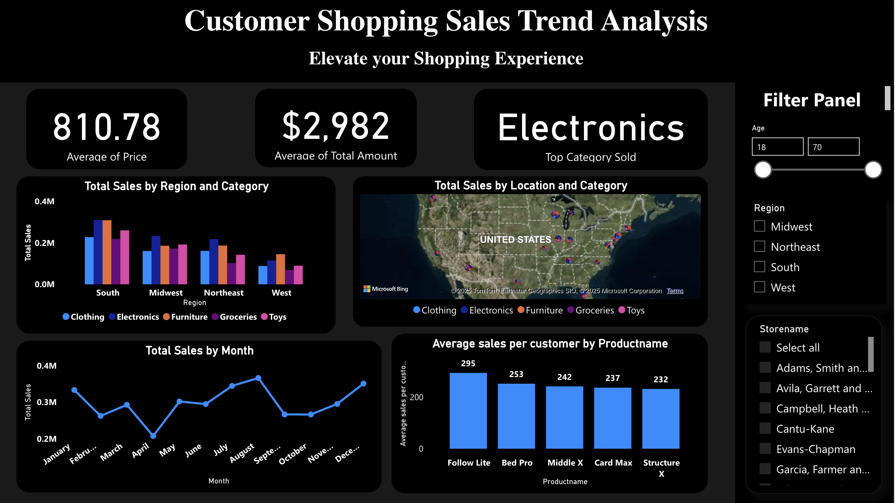
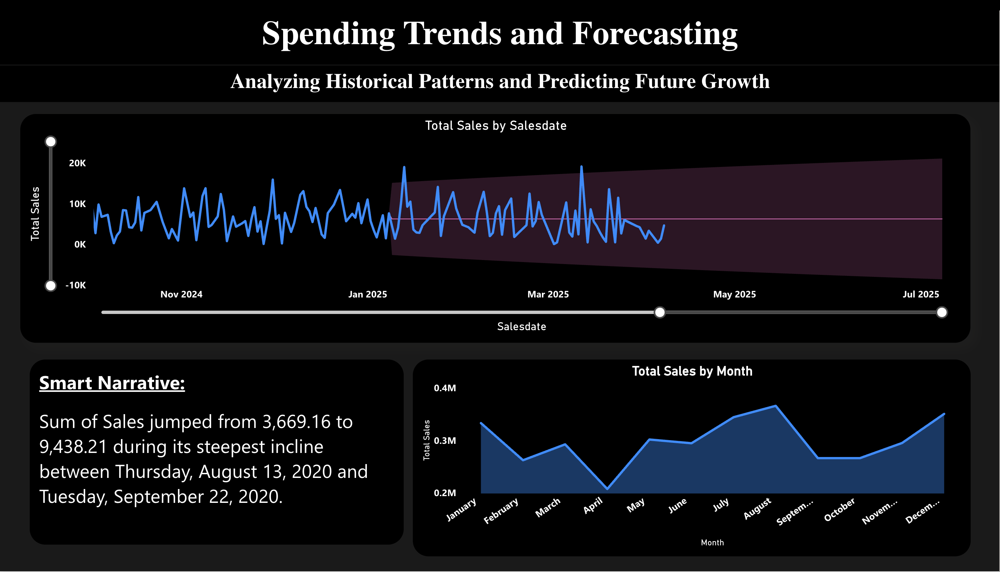
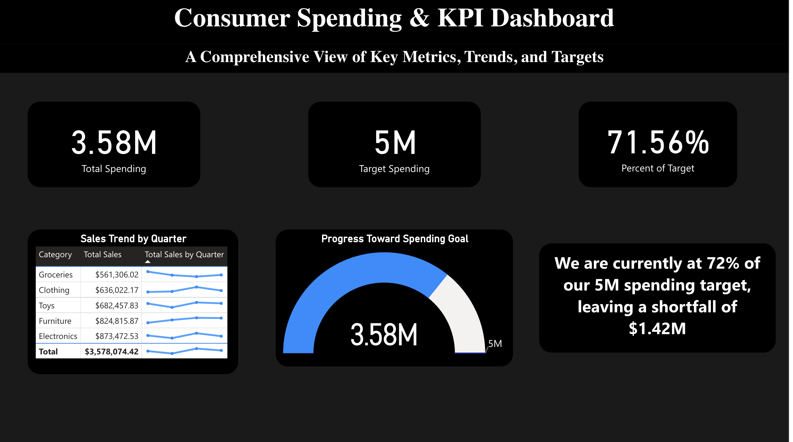

# 📊 Global Consumer Spending & Behavior Analysis – Power BI Project

## 🚀 Overview
This Power BI project provides a comprehensive, interactive analysis of global consumer spending patterns and behavior. The dashboards are designed to uncover insights across **geographic regions**, **demographics**, **product categories**, and **seasonal sales trends**.

Built using a **star schema data model** and powered by **DAX measures**, this project demonstrates the application of business intelligence to solve real-world sales and marketing questions through data-driven storytelling.

---

## 🎯 Project Objectives
- Identify **top-performing regions and categories** in terms of total sales and average purchase amount.
- Analyze the **impact of demographics (age, gender)** and **sales management** on consumer spending.
- Forecast **future spending patterns** using historical sales data.
- Track **key performance indicators (KPIs)** and compare them against targets.
- Provide a **clean, intuitive UI** with slicers, smart narratives, and thematic visuals for decision-makers.

---

## 📌 Key Features
✅ Interactive dashboards with slicers for:
- **Region**
- **Age Group**
- **Store and Manager**
  
✅ Visualizations include:
- Total & average sales by **region, category, and time**
- **State-wise and manager-wise** sales analysis
- **Gender-based** purchasing trends
- **Year-over-year comparison** by category
- **Forecasting using time series analysis**
- KPI cards showing target achievement and shortfalls

✅ Technical Highlights:
- **Data Modeling:** Star schema with fact and dimension tables (Sales, Product, Customer, Region, etc.)
- **Power Query:** Used for cleaning and transforming raw data
- **DAX Measures:** Created calculated fields for KPIs, averages, forecasts, and custom metrics
- **Smart Narrative:** Automatic text summarization of key patterns and outliers

---

## 🛠️ Tools & Technologies
- **Power BI Desktop**
- **DAX (Data Analysis Expressions)**
- **Power Query (ETL)**
- **Microsoft Bing Maps (for geo-analysis)**

---

## 🧠 Business Insights Extracted
- 📍 **Top-selling category:** Electronics  
- 🌎 **Best-performing region:** South region with highest total sales  
- 📅 **Sales peak period:** December, followed by August and January  
- 🧑‍🤝‍🧑 **Customer gender split:** Slightly higher sales from female customers (53%)  
- 📉 **Forecast Insight:** Projected sales show seasonal dips after March 2025

---

## 📁 Repository Structure

📸 Dashboard Previews

| Dashboard | Preview |
|----------|--------|
| Consumer Trends Overview |  |
| Demographic Impact |  |
| Forecasting Insights |  |
| KPI & Sales Target Dashboard |  |

---

